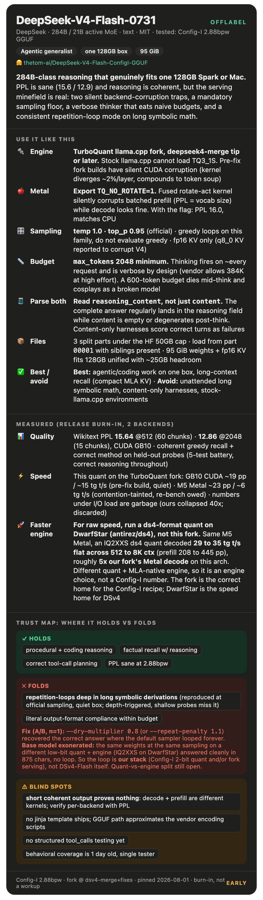

# DeepSeek-V4-Flash-0731 (Config-I 2.88 bpw GGUF): offlabel operating guide

> **Runs real 284B-class reasoning on a single 128GB Spark or Mac. Use the official sampling (temp 1.0, top_p 0.95), give it a big output budget, parse `reasoning_content` not just `content`, and do not hand it long unattended symbolic math. GGUF focus; MLX guide is backlog.**

## 🚀 Quickstart: do these five things

| | Do this | Why | Where |
|---|---|---|---|
| 1 | **Serve on the TurboQuant fork, current branch tip or later** | The quant uses fork-only TQ3_1S tensors; stock llama.cpp will not load it. Earlier fork builds have TWO silent correctness bugs this branch fixes (see 2 and 3) | §5 |
| 2 | **Metal: export `TQ_NO_ROTATE=1`** | The fused rotate-act Metal kernel silently corrupts batched prefill on this arch (decode looks fine, which is what makes it nasty). PPL goes from vocab-size garbage to 16.0 with the flag | §5a |
| 3 | **CUDA: use a build at or past the TQ3-bypass fix** | The fused TQ3_1S CUDA kernel diverges ~2% per layer on real weight distributions and compounds into token soup over 43 layers. Individual kernel tests pass; only end-to-end output shows it. Fixed by routing TQ3_1S through the dequant path | §5a |
| 4 | **Sampling: temp 1.0, top_p 0.95, and a real max_tokens (2048 minimum, more for math)** | Official card numbers. Thinking is verbose by design (vendor allows up to 384K output at high effort); a 600-token budget dies mid-think and looks like a broken model | §2 |
| 5 | **Parse `reasoning_content`, not just `content`** | The final answer frequently lands complete in the reasoning field while the visible content stream is empty or degenerate. A content-only harness scores correct turns as failures | §4 |

## ✅ Verify your setup (worth 5 minutes)

| Check | How | If it fails |
|---|---|---|
| **Prefill is not silently corrupted** | Run `llama-perplexity -c 512 --chunks 2` on your backend. Expect ~13 to 19 | PPL equal to the vocab size (129280) means uniform logits: you are on the broken Metal rotate path (add `TQ_NO_ROTATE=1`) or a pre-fix CUDA build |
| **Generation is coherent at depth** | Greedy 40 tokens on a factual prompt is NOT enough; the failure modes live deeper. Generate 2000+ tokens on a derivation-style prompt | Multilingual token soup from the start: wrong backend build. Late-onset verbatim looping: see §2b, it is the model plus quant, not your server |
| **Your harness sees the answer** | Send one reasoning-mode request; log `reasoning_content` and `content` separately | Empty content with a full reasoning field is NORMAL on this model under llama.cpp's crafted template. Read both fields |
| **File split loads** | The 95 GiB artifact ships as 3 parts (HF 50GB cap); point the loader at part 00001 | Loading a lone part fails; all three must sit in one directory |

## ⚡ Cheat sheet

| | |
|---|---|
| **Reach for it when** | agentic/coding work on a single 128GB box where you want 284B-class capability without an API; long-context recall (MLA KV is compact) |
| **Avoid it for** | unattended long symbolic math (repetition-loop failure mode, §2b); harnesses that cannot read `reasoning_content`; any stock-llama.cpp-only environment |
| **Thinking** | Fires on essentially every request via the crafted template ("[Start thinking]" preamble). No jinja template ships with the model; the vendor's own encoding scripts expose reasoning effort levels the GGUF path does not |
| **Sampling/serving** | temp 1.0, top_p 0.95, max_tokens >= 2048. Greedy (temp 0) is NOT representative and both vendors' history and our runs say it loops. FP16 KV cache; community reports q8_0 KV silently corrupts this arch |
| **Backends** | CUDA (GB10): correct on fixed builds, prompt ~19 t/s / decode ~15 t/s quiet. Metal (M5): correct with `TQ_NO_ROTATE=1`, ~23 t/s prompt / ~6 t/s decode. CPU: correct, slow |
| **Sizing** | 95 GiB weights + fp16 KV + buffers fits 128GB unified with roughly 25GB headroom. Model loads mmap'd; first-load page-in takes minutes |
| **Do NOT trust it to** | finish a long algebra derivation unattended (§2b); emit clean content when reasoning is enabled (§4); behave the same on a pre-fix fork build (§5a) |

## 1. Envelope: best at / not for

- **Best at (observed):** procedural and coding-shaped work. In our 5-probe battery the programming tests showed correct diagnosis and reasoning throughout (an O(n) merge, a bug hunt, a SQL aggregation). Factual recall with reasoning is clean and confident.
- **Not for:** long symbolic derivations without supervision (§2b), and anything that requires the content stream to be well formed while reasoning mode is on (§4).
- **Coverage honesty:** this is a quant-release burn-in, not a behavioral workup. Wikitext PPL 15.64 (ctx 512, 60 chunks) and 12.86 (ctx 2048, 15 chunks) on CUDA. An MMLU sample was attempted and abandoned at n=5 when concurrent uploads collapsed decode to 0.33 t/s; do not quote it.

## 2. Thinking / reasoning

- The GGUF path (llama.cpp crafted template, upstream #25414) fires thinking on effectively every request. The vendor ships no jinja template at all: the official interface is a python `encoding` folder with `thinking_mode` and `reasoning_effort` (low/high/max) knobs that the GGUF ecosystem currently approximates with one fixed mode.
- Reasoning is verbose by design. The official card allows up to 384K output tokens at high effort. Budget accordingly: a 600-token budget on a math prompt dies inside the think block 100% of the time in our runs and looks like a failure when it is actually truncation.
- **Sampling floor is real.** Official: temp 1.0, top_p 0.95 (top_p 1.0 outside agentic use). Greedy decoding has a documented looping history on this model family and our greedy runs loop too. Do not evaluate this model greedy and report the results as model quality.

## 2b. The repetition-loop failure mode (measured, consistent, open)

The single behavioral finding that most needs to be on your radar:

- **What happens:** deep inside a long symbolic derivation (hundreds of tokens into the think block), the model can fall into verbatim repetition of an expression fragment and never recover, burning the rest of the budget. Example observed: "(a^n, b^n) = " repeated to the 2500-token ceiling on an abstract algebra order-of-element problem.
- **What it is not:** not greedy-specific (reproduced at official temp 1.0 / top_p 0.95), not load-related (reproduced on a quiet box), not truncation (the budget was generous), and not a backend bug (the same class of output appears on a verified-correct backend).
- **Incidence:** shallow probes miss it. Twelve 600-token runs showed zero loops because they never got deep enough; the first 2500-token derivation run hit it. Treat it as depth-triggered with meaningful per-run probability, not as rare.
- **Attribution (narrowed 2026-08-01 via a DwarfStar A/B):** the base 0731 weights are **not** the cause. The same prompt at the same sampling (temp 1.0, top_p 0.95, no anti-repetition) on a **different low-bit quant + a different engine** (community IQ2XXS ds4-format on DwarfStar/antirez-ds4) answered **cleanly, correctly, and tersely (875 chars, no loop)**. So the loop is introduced by **our stack**: the Config-I 2-bit-expert quant, the fork's serving path, or both. This A/B cannot split quant-from-engine (both differ at once), so "which of the two" is still open, but "the base model just loops on hard math" is refuted. A same-engine bf16-vs-Config-I A/B would finish the separation and is backlog.
- **Related finding from the same A/B: the budget-eating verbosity is largely the serving path, not the model.** DwarfStar's ds4 thinking mode answered this in ~875 characters; our fork's llama.cpp crafted-template path thinks for thousands of tokens on the identical prompt. So the "give it a huge budget" advice above is really advice for **this serving path**, not an intrinsic property of DSv4-Flash.
- **Mitigations (updated 2026-08-01, A/B run):** anti-repetition sampling **fixes the tested case**. On the abstract-algebra order-of-element prompt that looped to the ceiling under the default sampler, **both `--dry-multiplier 0.8 --dry-base 1.75` and `--repeat-penalty 1.1` reached the correct "Order: 3"** at temp 1.0 / top_p 0.95. DRY is the more targeted tool (it penalizes verbatim n-gram repeats specifically) and is the recommended default for math-heavy use; repeat-penalty also worked but is blunter. Backups: cap output and retry on loop detection (a unique-line or compression-ratio tail metric catches it cheaply), or route hard symbolic math elsewhere. n=1 prompt so far; broader confirmation is backlog, but the direction is clear and the fix is free to apply.

## 4. Tools, agents, and the two-stream trap

- **Answer-in-reasoning:** with reasoning enabled under llama.cpp, the complete, well-formatted final answer regularly appears in `reasoning_content` while `content` is empty or, worse, degenerates into repetition after the think close. A harness that only reads `content` will score correct turns as failures. We hit this in our own eval harness before instrumenting both fields. This matches the cross-model finding in this repo's patterns doc: reasoning-field handling is runtime-specific and silently load-bearing.
- **Tool-call formatting (observational, n=4):** asked to emit `tool_name(args)` calls in a specified format, the model reasons correctly about which calls to make but did not reliably emit the literal format in the content stream within budget. No structured tool-call (`tool_calls` array) testing has been done yet on this quant; the model card ships no tool schema and the encoding scripts do not document one. Backlog.

## 5. Sampling & serving

- **Engine requirement:** TurboQuant llama.cpp fork, branch with the deepseek4 merge or later. Stock llama.cpp cannot load TQ3_1S tensors, full stop. If you need stock compatibility, wait for the upstream-types edition (Q2_0 experts + Q3_K signal path, in progress) or use a community imatrix quant and lose the Config-I recipe.
- **KV cache:** fp16. Upstream enforces same-type K/V for this arch and enables flash attention when V is quantized; community reports q8_0 KV silently corrupts V4 output. We tested fp16 only.
- **Splits:** 3 files under the HF 50GB cap; llama.cpp loads from part 00001 automatically when siblings are present.
- **Throughput (quiet box):** GB10 CUDA ~19 t/s prompt / ~15 t/s decode measured pre-fix; the TQ3-bypass fix trades some decode speed for correctness and has not been re-benched quiet yet. M5 Metal ~23 t/s prompt / ~6 t/s decode (contention-tainted, a clean re-bench is owed). Numbers taken under upload I/O contention are meaningless; ours collapsed 40x and we discarded them.
- **Engine choice matters more than this quant, for speed (measured 2026-08-01).** DSv4 has a dedicated inference engine, **DwarfStar (antirez/ds4)**, built around MLA and its compressed KV. On the **same M5 Max, Metal**, a community ds4-format quant (IQ2XXS-w2Q2K imatrix, 81 GiB) decoded **29 to 35 tok/s flat from 512 to 8192 context** (prefill 208 to 445 tok/s), against our fork's Metal path at ~6 tok/s decode. That is roughly **5x on decode and an order of magnitude on prefill**. Caveats: different quant (not Config-I), and our fork number is contention-tainted and runs the slow `TQ_NO_ROTATE` dequant path. But the direction is unambiguous and the flat decode-vs-context curve is what a purpose-built MLA engine should look like. **Practical read: the TurboQuant fork is the correct home for the Config-I recipe and its size, but if you want raw DSv4 speed on Apple Silicon, serve a ds4-format quant on DwarfStar.** A clean fork-vs-DwarfStar re-bench at matched conditions, and a re-check after the Metal rotate-act kernel fix lands, are both backlog.

## 5a. The three silent backend traps (each cost us hours; all verified)

1. **Metal batched prefill corruption.** The fork's fused rotate-act TQ matmul produces exactly-uniform logits (PPL = vocab size) on this arch at batch > 1 while single-token decode stays coherent. `TQ_NO_ROTATE=1` routes through the safe dequant path: PPL 16.0, matching CPU. Kernel-level fix is open. If you bench Metal without the flag you are benching noise.
2. **CUDA fused TQ3_1S divergence.** On real weight distributions the fused kernel diverges about 2% per layer and compounds to token soup; synthetic-data kernel tests pass, which is why it survived. Found by node-level activation diffing (ngl 0 vs ngl 99, first divergent node blk.0.attn_q_a). Fixed by routing TQ3_1S mul_mats through dequant+cuBLAS. Pin a build at or past that commit.
3. **Both bugs shared a lesson:** short coherent generation proves almost nothing on this quant family. Decode paths and prefill paths are different kernels; correctness must be checked per-backend with perplexity, not vibes.

## 10. Changelog

- 2026-08-01: initial guide from the Config-I quant release burn-in. PPL, backend traps, sampling floor, repetition-loop finding, two-stream trap. Anti-loop sampler A/B running; MLX guide and structured tool-call testing backlog.
